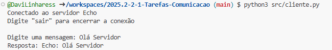
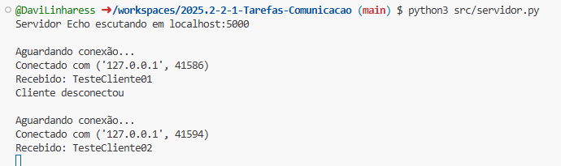
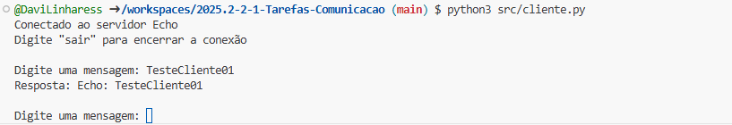
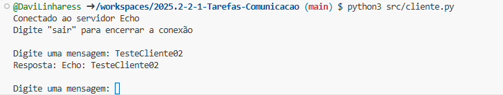
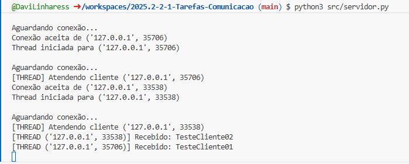

# Relato da atividade de comunicação entre processos usando sockets

## Informações gerais
- **disciplina**: Sistemas Operacionais
- **semestre letivo**: 2025.2
- **aluno**: Davi de Medeiros Linhares

## Parte 1 — 1 servidor e 1 cliente (bloqueante)

### ✔ Checklist verificado
- [x] Servidor iniciou sem erros e ficou aguardando conexão.
- [x] Cliente conectou com sucesso.
- [x] Houve troca de mensagens (cliente → servidor → cliente).
- [x] Conexões encerradas corretamente, sem erros.

### 📝 Relato
O servidor foi iniciado no Terminal A e exibiu a mensagem indicando que estava aguardando conexões.  
No Terminal B executei o cliente, que conseguiu conectar imediatamente.

**Interação:**  
- O cliente enviou: 

- O servidor respondeu: 

Após a troca, tanto cliente quanto servidor encerraram a conexão normalmente.  
O servidor permaneceu ativo aguardando novas conexões, sem exceções.

## Parte 2 — 1 servidor e 2 clientes (bloqueante)

### ✔ Checklist observado
- [x] Apenas um cliente foi atendido de cada vez.
- [x] Segundo cliente aguardou ou recebeu recusa dependendo do timing.
- [x] Servidor permaneceu estável.
- [x] Timestamps mostraram atendimento em série.

### 📝 Relato
Executei dois clientes quase ao mesmo tempo.  
O comportamento observado foi:

- O cliente 1 conectou e foi atendido imediatamente.  
- O cliente 2 tentou conectar logo depois e não recebeu nenhuma mensagem.

**Evidências:**  
- Servidor Aberto:

- Cliente01 Manda mensagem: 

- Cliente02 tenta mensagem: 

- Recebimento do Servidor: 

- Recebimento do Servidor Após Cliente1 sair: 

Isso mostra que o atendimento foi um por um, pois o servidor só trata uma conexão por vez.

**Perguntas respondidas:**

1. **O segundo cliente bloqueou? Por quanto tempo?**  
   O Segundo Cliente foi Bloqueado. Enquanto o Cliente01 estava logado. Apos ele digitar "sair", a mensagem do Cliente02 chegou ao servidor.

2. **O servidor atende estritamente em série? O que evidencia isso?**  
   Sim. O tratamento do Cliente02 só começou depois que o Cliente01 encerrou sua seção.

## Parte 3 — Modificar o servidor para múltiplos clientes (concorrente)

### 📝 Estratégia escolhida
A abordagem escolhida foi threads.  
  - Para cada conexão aceita, criei uma nova thread chamando `handle_client()`.
  - O loop principal continua chamando `accept()` imediatamente.
  - Cada thread cuida de apenas um cliente e encerra a conexão ao terminar.

### ✔ Checklist de implementação
- [x] `accept()` não bloqueia mais o atendimento de novos clientes.
- [x] Cada conexão é tratada isoladamente.
- [x] Exceções tratadas sem derrubar o servidor.
- [x] Sockets fechados corretamente.
- [x] Logs incluem "conexão iniciada" e "conexão encerrada".
- [x] Introduzido `sleep` para demonstrar paralelismo (opcional).

### Mudanças principais realizadas
Transformei o servidor de bloqueante para concorrente criando uma função handle_client() e
iniciando uma Thread para cada conexão aceita. Assim, o loop principal continua chamando accept()
enquanto cada cliente é atendido em paralelo pela sua thread.

## Parte 4 — 1 servidor concorrente e 2 clientes

### ✔ Checklist verificado
- [x] Ambos os clientes conectaram sem bloquear.
- [x] Timestamps mostraram processamento paralelo.
- [x] Servidor registrou múltiplos atendimentos simultâneos.
- [x] Nenhuma exceção não tratada.

### 📝 Relato
Após iniciar o servidor concorrente, disparei dois clientes quase ao mesmo tempo.

Os dois foram atendidos em paralelo, como esperado.

**Evidência do paralelismo:**  
- Cliente 1 iniciou: 

- Cliente 2 iniciou: 

- Servidor Recebendo os Dois: 

Isso confirma que o servidor está realmente funcionando.

## Conclusões

- O servidor bloqueante é simples, mas só lida com um cliente por vez, causando fila e demora.
- O servidor concorrente permite múltiplos atendimentos ao mesmo tempo, melhorando responsividade.
- Threads são uma solução simples e intuitiva, porém possuem sobrecusto e riscos de corrida.
- A implementação final atendeu ao objetivo da atividade.

